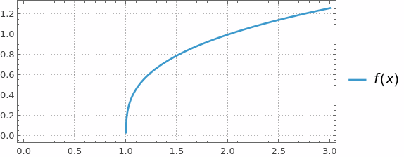
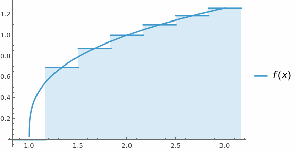
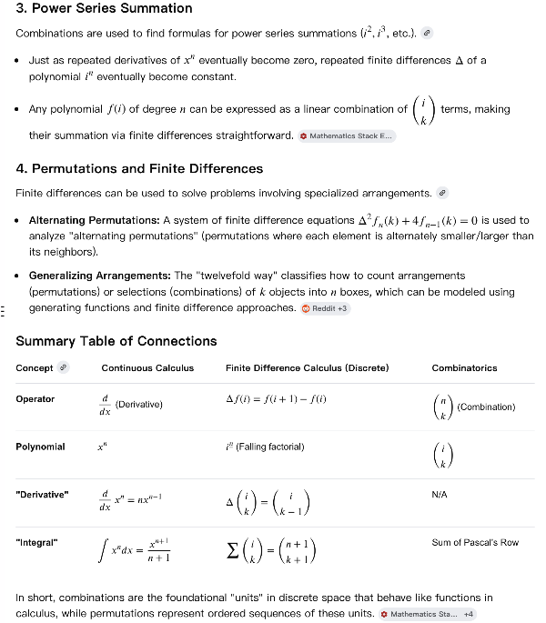
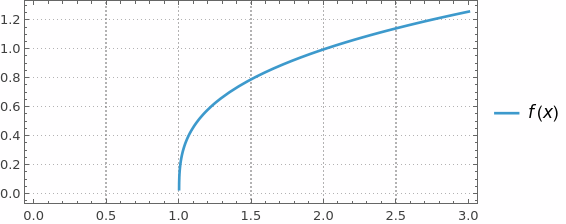
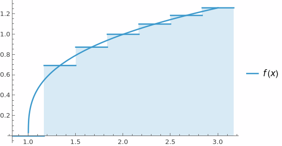
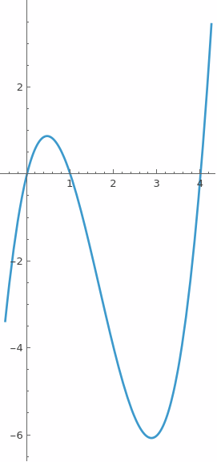
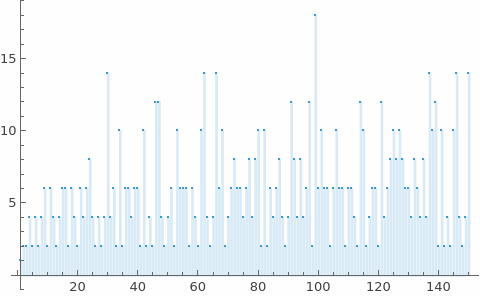
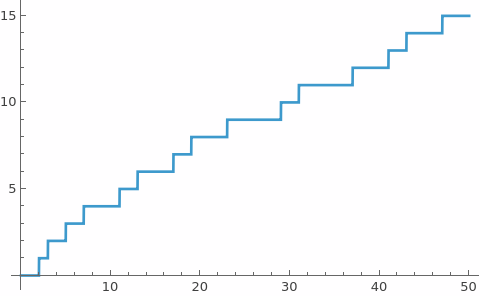
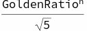

# Discrete Calculus

## 1. Intro

keywords : sequences/series, finite differences, sums/products, gfun
e . g . Finite Sums / Infinite Sums,    Riemann Sums


15

1







### Sigma Notation

#### Basic Examples


```wl
Out[]= 15
```

#### Infinite Sums


```wl
Out[]= 1
```


```wl
Out[]= E
```

### Riemann Sums




```wl
In[]:= Show[DiscretePlot[f[x], {x, 1, 3, 1/3}, ExtentSize -> Full], plot]
```




```wl
Out[]= 2.03771
```

### Product Notation


```wl
In[]:= 120
```


```wl
In[]:= 3.0899225749115415`
```

### Taylor Series


### Finite Differences





```wl
In[]:= (*coding form*)
   f'[x] 
    Limit[difForward[x, h], h -> 0] 
    Limit[difBackward[x, h], h -> 0] 
    Simplify[Limit[difCentral[x, h], h -> 0]]
```

```wl
Out[]= 4 - 10 x + 3 x^2
```

```wl
Out[]= 4 - 10 x + 3 x^2
```

```wl
Out[]= 4 - 10 x + 3 x^2
```

```wl
Out[]= 4 - 10 x + 3 x^2
```

$$\text{(*math form*)}f'(x)\underset{h\to 0}{\text{lim}}\text{difForward}(x,h)\underset{h\to 0}{\text{lim}}\text{difBackward}(x,h)\text{Simplify}[\underset{h\to 0}{\text{lim}}\text{difCentral}(x,h)]$$

```wl
Out[]= 4 - 10 x + 3 x^2
```

```wl
Out[]= 4 - 10 x + 3 x^2
```

```wl
Out[]= 4 - 10 x + 3 x^2
```

```wl
Out[]= 4 - 10 x + 3 x^2
```

## 2. Number Theory

```wl
In[]:= Divisible[10, 5]
 Mod[12, 10](*cannot use %*)
```

```wl
Out[]= True
```

```wl
Out[]= 2
```

```wl
In[]:= a = 420;   (*separate input cell*)
 b = 860;
```

```wl
In[]:= (*repeat until output appears*)
   r = Mod[a, b]; 
    a = b; 
    If[r > 0, b = r, Print[a]];
```

```wl
Out[]= 20
```

```wl
In[]:= (*only need to run once*)
   r = Mod[a, b]; 
    a = b; 
    While[r > 0, b = r; r = Mod[a, b]; a = b] 
    Print[a]
```

```wl
Out[]= 20
```

```wl
In[]:= GCD[a, b]
```

```wl
Out[]= 20
```

## 3. Primes

### Basic Things

```wl
In[]:= Table[Prime[i], {i, 10}]
```

```wl
Out[]= {2, 3, 5, 7, 11, 13, 17, 19, 23, 29}
```

```wl
In[]:= PrimeQ[67]
 PrimeQ[267]
 CompositeQ[6767]
 CompositeQ[673]
```

```wl
Out[]= True
```

```wl
Out[]= False
```

```wl
Out[]= True
```

```wl
Out[]= False
```

```wl
In[]:= gap[n_] = Prime[n + 1] - Prime[n];
 DiscretePlot[gap[n], {n, 150}]
```



```wl
In[]:= RandomPrime[100]
```

```wl
Out[]= 73
```

```wl
In[]:= Plot[PrimePi[x], {x, 0, 50}]
```



### Applications

```wl
In[]:= (*RSA Encryption*)
   p = Prime[18]; 
    q = Prime[16]; 
    n = p*q
```

```wl
Out[]= 3233
```

```wl
In[]:= EulerPhi[n]
 u = 17;
 k = 15;
 CoprimeQ[u, EulerPhi[n]]
 PrivKey = (k*EulerPhi[n] + 1)/u
```

```wl
Out[]= 3120
```

```wl
Out[]= True
```

```wl
Out[]= 2753
```

```wl
In[]:= data = ToCharacterCode["Secret"]
 encrypted = Mod[data^u, n]
```

```wl
Out[]= {83, 101, 99, 114, 101, 116}
```

```wl
Out[]= {2680, 1313, 281, 2412, 1313, 884}
```

```wl
In[]:= decrypted = Mod[encrypted^PrivKey, n]
```

```wl
Out[]= {83, 101, 99, 114, 101, 116}
```

```wl
In[]:= EulerPhi[n] == (p - 1) (q - 1)
```

```wl
Out[]= True
```

## 4. Fibonacci

```wl
In[]:= DiscreteAsymptotic[Fibonacci[n]/Fibonacci[n - 1], n -> \[Infinity]]
 DiscreteAsymptotic[Fibonacci[n], n -> \[Infinity]]
```

```wl
Out[]= GoldenRatio
```

