# Discrete Calculus

## 1. Intro

keywords : sequences/series, finite differences, sums/products, gfun
e . g . Finite Sums / Infinite Sums,    Riemann Sums

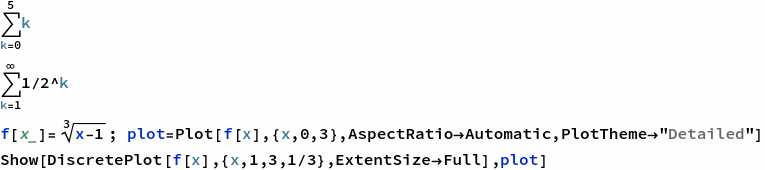

15

1

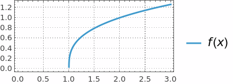

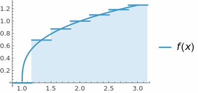

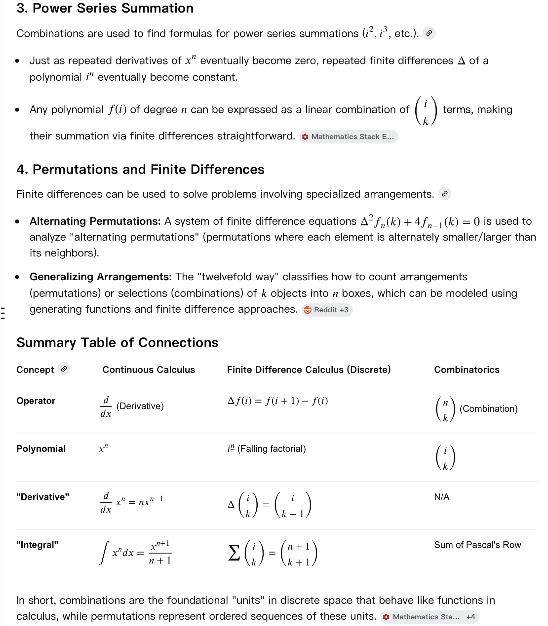

##### Sigma Notation

Basic Examples

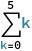

```wl
Out[]= 15
```

Infinite Sums

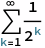

```wl
Out[]= 1
```

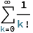

```wl
Out[]= E
```

##### Riemann Sums

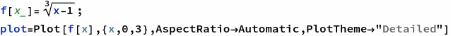

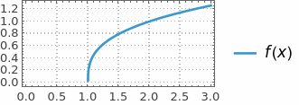

```wl
In[]:= Show[DiscretePlot[f[x], {x, 1, 3, 1/3}, ExtentSize -> Full], plot]
```

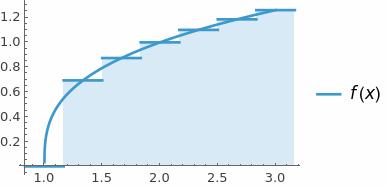

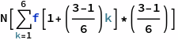

```wl
Out[]= 2.03771
```

##### Product Notation

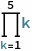

```wl
In[]:= 120
```

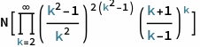

```wl
In[]:= 3.0899225749115415`
```

##### Taylor Series

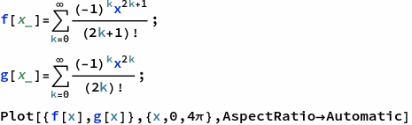


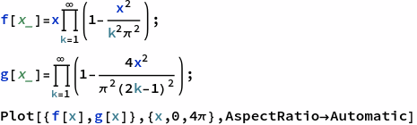

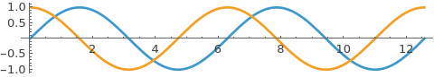

##### Finite Differences

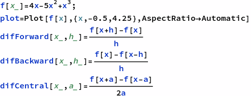

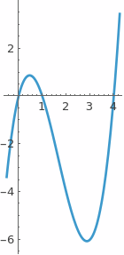

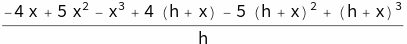

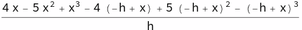

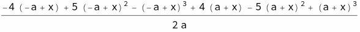

```wl
In[]:= (*coding form*)
   f'[x] 
    Limit[difForward[x, h], h -> 0] 
    Limit[difBackward[x, h], h -> 0] 
    Simplify[Limit[difCentral[x, h], h -> 0]]
```

```wl
Out[]= 4 - 10 x + 3 x^2
```

```wl
Out[]= 4 - 10 x + 3 x^2
```

```wl
Out[]= 4 - 10 x + 3 x^2
```

```wl
Out[]= 4 - 10 x + 3 x^2
```

$$\text{(*math form*)}f'(x)\underset{h\to 0}{\text{lim}}\text{difForward}(x,h)\underset{h\to 0}{\text{lim}}\text{difBackward}(x,h)\text{Simplify}[\underset{h\to 0}{\text{lim}}\text{difCentral}(x,h)]$$

```wl
Out[]= 4 - 10 x + 3 x^2
```

```wl
Out[]= 4 - 10 x + 3 x^2
```

```wl
Out[]= 4 - 10 x + 3 x^2
```

```wl
Out[]= 4 - 10 x + 3 x^2
```

## 2. Number Theory

```wl
In[]:= Divisible[10, 5]
 Mod[12, 10](*cannot use %*)
```

```wl
Out[]= True
```

```wl
Out[]= 2
```

```wl
In[]:= a = 420;   (*separate input cell*)
 b = 860;
```

```wl
In[]:= (*repeat until output appears*)
   r = Mod[a, b]; 
    a = b; 
    If[r > 0, b = r, Print[a]];
```

```wl
Out[]= 20
```

```wl
In[]:= (*only need to run once*)
   r = Mod[a, b]; 
    a = b; 
    While[r > 0, b = r; r = Mod[a, b]; a = b] 
    Print[a]
```

```wl
Out[]= 20
```

```wl
In[]:= GCD[a, b]
```

```wl
Out[]= 20
```

## 3. Primes

### Basic Things

```wl
In[]:= Table[Prime[i], {i, 10}]
```

```wl
Out[]= {2, 3, 5, 7, 11, 13, 17, 19, 23, 29}
```

```wl
In[]:= PrimeQ[67]
 PrimeQ[267]
 CompositeQ[6767]
 CompositeQ[673]
```

```wl
Out[]= True
```

```wl
Out[]= False
```

```wl
Out[]= True
```

```wl
Out[]= False
```

```wl
In[]:= gap[n_] = Prime[n + 1] - Prime[n];
 DiscretePlot[gap[n], {n, 150}]
```

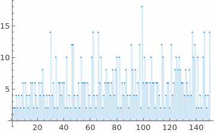

```wl
In[]:= RandomPrime[100]
```

```wl
Out[]= 73
```

```wl
In[]:= Plot[PrimePi[x], {x, 0, 50}]
```

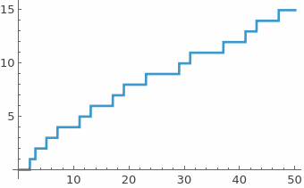

### Applications

```wl
In[]:= (*RSA Encryption*)
   p = Prime[18]; 
    q = Prime[16]; 
    n = p*q
```

```wl
Out[]= 3233
```

```wl
In[]:= EulerPhi[n]
 u = 17;
 k = 15;
 CoprimeQ[u, EulerPhi[n]]
 PrivKey = (k*EulerPhi[n] + 1)/u
```

```wl
Out[]= 3120
```

```wl
Out[]= True
```

```wl
Out[]= 2753
```

```wl
In[]:= data = ToCharacterCode["Secret"]
 encrypted = Mod[data^u, n]
```

```wl
Out[]= {83, 101, 99, 114, 101, 116}
```

```wl
Out[]= {2680, 1313, 281, 2412, 1313, 884}
```

```wl
In[]:= decrypted = Mod[encrypted^PrivKey, n]
```

```wl
Out[]= {83, 101, 99, 114, 101, 116}
```

```wl
In[]:= EulerPhi[n] == (p - 1) (q - 1)
```

```wl
Out[]= True
```

## 4. Fibonacci

```wl
In[]:= DiscreteAsymptotic[Fibonacci[n]/Fibonacci[n - 1], n -> \[Infinity]]
 DiscreteAsymptotic[Fibonacci[n], n -> \[Infinity]]
```

```wl
Out[]= GoldenRatio
```

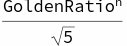

```wl
In[]:= Table[Fibonacci[i], {i, -20, 20}]      (*including 0 is optional*)
```

```wl
Out[]= {-6765, 4181, -2584, 1597, -987, 610, -377, 233, -144, 89, -55, 34, -21, 13, -8, 5, -3, 2, -1, 1, 0, 1, 1, 2, 3, 5, 8, 13, 21, 34, 55, 89, 144, 233, 377, 610, 987, 1597, 2584, 4181, 6765}
```

```wl
In[]:= Table[Fibonacci[i, x], {i, -5, 5}]
```

```wl
Out[]= {1 + 3 x^2 + x^4, -2 x - x^3, 1 + x^2, -x, 1, 0, 1, x, 1 + x^2, 2 x + x^3, 1 + 3 x^2 + x^4}
```

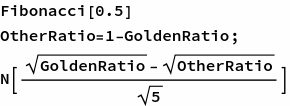

```wl
Out[]= 0.568864
```

```wl
Out[]= 0.568864 - 0.351578 I
```

When Fib inputs expand from integers to continuous, use Euler's formula to calculate powers.
Sage coding: def a(n): return BinaryRecurrenceSequence(1, 1).period(n)           Lucas sequence is BinaryRecurrenceSequence and Fib is special Lucas

```wl
In[]:= test[{0, 1, _}] := False; test[_] := True;
 nest[k_][{a_, b_, c_}] := {Mod[b, k], Mod[a + b, k], c + 1};
 A001175[1] := 1;
 A001175[k_] := NestWhile[nest[k], {1, 1, 1}, test][[3]];
 Table[A001175[n], {n, 100}] (* Leo C. Stein, Nov 08 2019 *)
```

```wl
Out[]= {1, 3, 8, 6, 20, 24, 16, 12, 24, 60, 10, 24, 28, 48, 40, 24, 36, 24, 18, 60, 16, 30, 48, 24, 100, 84, 72, 48, 14, 120, 30, 48, 40, 36, 80, 24, 76, 18, 56, 60, 40, 48, 88, 30, 120, 48, 32, 24, 112, 300, 72, 84, 108, 72, 20, 48, 72, 42, 58, 120, 60, 30, 48, 96, 140, 120, 136, 36, 48, 240, 70, 24, 148, 228, 200, 18, 80, 168, 78, 120, 216, 120, 168, 48, 180, 264, 56, 60, 44, 120, 112, 48, 120, 96, 180, 48, 196, 336, 120, 300}
```

```wl
In[]:= PolarPlot[GoldenRatio^(2 \[Theta]/\[Pi]), {\[Theta], 0, 9 \[Pi]}]
```

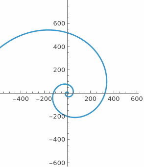

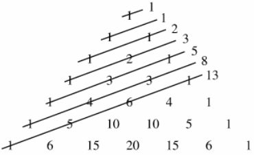

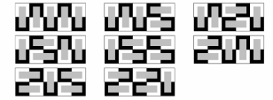