# Discrete Calculus

```wl
In[]:= RunScheduledTask[NotebookSave[EvaluationNotebook[]], 30]
```


## 1. Intro

keywords : sequences/series, finite differences, sums/products, gfun
e . g . Finite Sums / Infinite Sums,    Riemann Sums

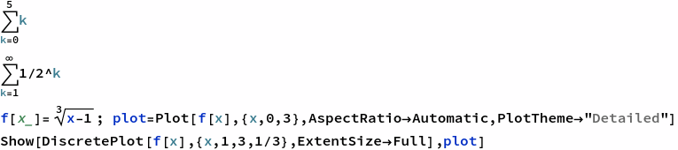

15

1

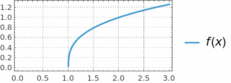

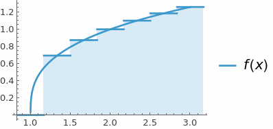

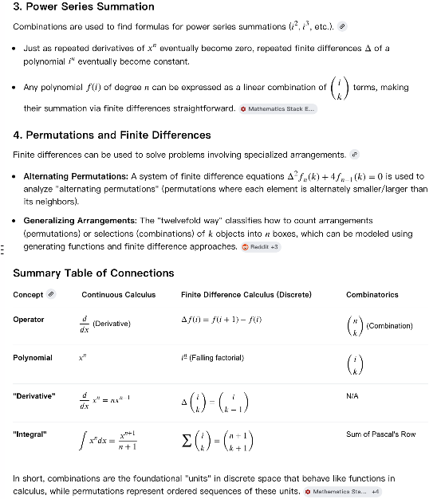

##### Sigma Notation

Basic Examples

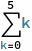

```wl
Out[]= 15
```

Infinite Sums

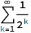

```wl
Out[]= 1
```

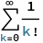

```wl
Out[]= E
```

##### Riemann Sums

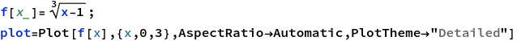

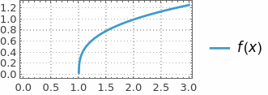

```wl
In[]:= Show[DiscretePlot[f[x], {x, 1, 3, 1/3}, ExtentSize -> Full], plot]
```

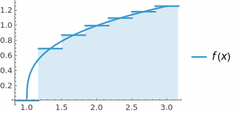

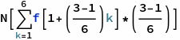

```wl
Out[]= 2.03771
```

##### Product Notation

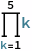

```wl
In[]:= 120
```

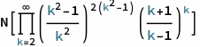

```wl
In[]:= 3.0899225749115415`
```

##### Taylor Series

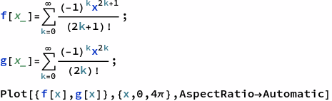


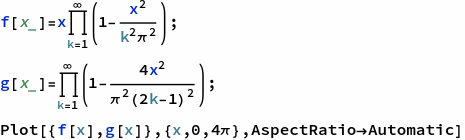

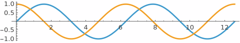

##### Finite Differences

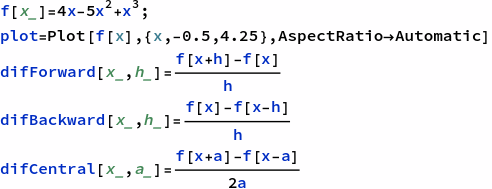

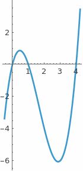

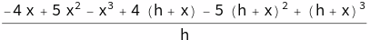

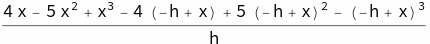

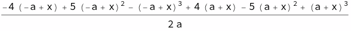

```wl
In[]:= (*coding form*)
   f'[x] 
    Limit[difForward[x, h], h -> 0] 
    Limit[difBackward[x, h], h -> 0] 
    Simplify[Limit[difCentral[x, h], h -> 0]]
```

```wl
Out[]= 4 - 10 x + 3 x^2
```

```wl
Out[]= 4 - 10 x + 3 x^2
```

```wl
Out[]= 4 - 10 x + 3 x^2
```

```wl
Out[]= 4 - 10 x + 3 x^2
```

$$\text{(*math form*)}f'(x)\underset{h\to 0}{\text{lim}}\text{difForward}(x,h)\underset{h\to 0}{\text{lim}}\text{difBackward}(x,h)\text{Simplify}[\underset{h\to 0}{\text{lim}}\text{difCentral}(x,h)]$$

```wl
Out[]= 4 - 10 x + 3 x^2
```

```wl
Out[]= 4 - 10 x + 3 x^2
```

```wl
Out[]= 4 - 10 x + 3 x^2
```

```wl
Out[]= 4 - 10 x + 3 x^2
```

## 2. Number Theory

```wl
In[]:= Divisible[10, 5]
 Mod[12, 10](*cannot use %*)
```

```wl
Out[]= True
```

```wl
Out[]= 2
```

```wl
In[]:= a = 420;   (*separate input cell*)
 b = 860;
```

```wl
In[]:= (*repeat until output appears*)
   r = Mod[a, b]; 
    a = b; 
    If[r > 0, b = r, Print[a]];
```

```wl
Out[]= 20
```

```wl
In[]:= (*only need to run once*)
   r = Mod[a, b]; 
    a = b; 
    While[r > 0, b = r; r = Mod[a, b]; a = b] 
    Print[a]
```

```wl
Out[]= 20
```

```wl
In[]:= GCD[a, b]
```

```wl
Out[]= 20
```

## 3. Primes

### Basic Things

```wl
In[]:= Table[Prime[i], {i, 10}]
```

```wl
Out[]= {2, 3, 5, 7, 11, 13, 17, 19, 23, 29}
```

```wl
In[]:= PrimeQ[67]
 PrimeQ[267]
 CompositeQ[6767]
 CompositeQ[673]
```

```wl
Out[]= True
```

```wl
Out[]= False
```

```wl
Out[]= True
```

```wl
Out[]= False
```

```wl
In[]:= gap[n_] = Prime[n + 1] - Prime[n];
 DiscretePlot[gap[n], {n, 150}]
```

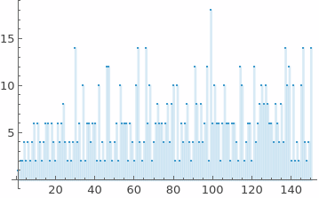

```wl
In[]:= RandomPrime[100]
```

```wl
Out[]= 73
```

```wl
In[]:= Plot[PrimePi[x], {x, 0, 50}]
```

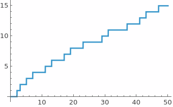

### Applications

```wl
In[]:= (*RSA Encryption*)
   p = Prime[18]; 
    q = Prime[16]; 
    n = p*q
```

```wl
Out[]= 3233
```

```wl
In[]:= EulerPhi[n]
 u = 17;
 k = 15;
 CoprimeQ[u, EulerPhi[n]]
 PrivKey = (k*EulerPhi[n] + 1)/u
```

```wl
Out[]= 3120
```

```wl
Out[]= True
```

```wl
Out[]= 2753
```

```wl
In[]:= data = ToCharacterCode["Secret"]
 encrypted = Mod[data^u, n]
```

```wl
Out[]= {83, 101, 99, 114, 101, 116}
```

```wl
Out[]= {2680, 1313, 281, 2412, 1313, 884}
```

```wl
In[]:= decrypted = Mod[encrypted^PrivKey, n]
```

```wl
Out[]= {83, 101, 99, 114, 101, 116}
```

```wl
In[]:= EulerPhi[n] == (p - 1) (q - 1)
```

```wl
Out[]= True
```

## 4. Fibonacci

```wl
In[]:= DiscreteAsymptotic[Fibonacci[n]/Fibonacci[n - 1], n -> \[Infinity]]
 DiscreteAsymptotic[Fibonacci[n], n -> \[Infinity]]
```

```wl
Out[]= GoldenRatio
```

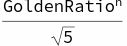

```wl
In[]:= Table[Fibonacci[i], {i, -20, 20}]      (*including 0 is optional*)
```

```wl
Out[]= {-6765, 4181, -2584, 1597, -987, 610, -377, 233, -144, 89, -55, 34, -21, 13, -8, 5, -3, 2, -1, 1, 0, 1, 1, 2, 3, 5, 8, 13, 21, 34, 55, 89, 144, 233, 377, 610, 987, 1597, 2584, 4181, 6765}
```

```wl
In[]:= Table[Fibonacci[i, x], {i, -5, 5}]
```

```wl
Out[]= {1 + 3 x^2 + x^4, -2 x - x^3, 1 + x^2, -x, 1, 0, 1, x, 1 + x^2, 2 x + x^3, 1 + 3 x^2 + x^4}
```

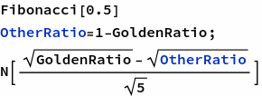

```wl
Out[]= 0.568864
```

```wl
Out[]= 0.568864 - 0.351578 I
```

When Fib inputs expand from integers to continuous, use Euler's formula to calculate powers.
Sage coding: def a(n): return BinaryRecurrenceSequence(1, 1).period(n)           Lucas sequence is BinaryRecurrenceSequence and Fib is special Lucas

```wl
In[]:= test[{0, 1, _}] := False; test[_] := True;
 nest[k_][{a_, b_, c_}] := {Mod[b, k], Mod[a + b, k], c + 1};
 A001175[1] := 1;
 A001175[k_] := NestWhile[nest[k], {1, 1, 1}, test][[3]];
 Table[A001175[n], {n, 100}] (* Leo C. Stein, Nov 08 2019 *)
```

```wl
Out[]= {1, 3, 8, 6, 20, 24, 16, 12, 24, 60, 10, 24, 28, 48, 40, 24, 36, 24, 18, 60, 16, 30, 48, 24, 100, 84, 72, 48, 14, 120, 30, 48, 40, 36, 80, 24, 76, 18, 56, 60, 40, 48, 88, 30, 120, 48, 32, 24, 112, 300, 72, 84, 108, 72, 20, 48, 72, 42, 58, 120, 60, 30, 48, 96, 140, 120, 136, 36, 48, 240, 70, 24, 148, 228, 200, 18, 80, 168, 78, 120, 216, 120, 168, 48, 180, 264, 56, 60, 44, 120, 112, 48, 120, 96, 180, 48, 196, 336, 120, 300}
```

```wl
In[]:= PolarPlot[GoldenRatio^(2 \[Theta]/\[Pi]), {\[Theta], 0, 9 \[Pi]}]
```

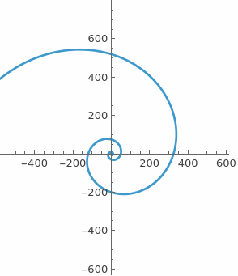

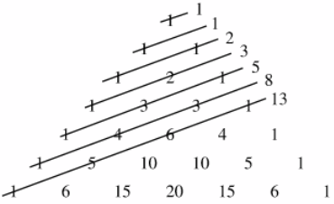

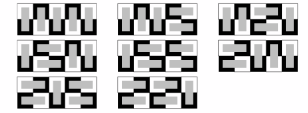

## 5. Permutations and Combinations

```wl
In[]:= Perm[n_, k_] = n!/(n - k)!;
 Perm[11, 11]
```

```wl
Out[]= 39916800
```

```wl
In[]:= Length[Permutations[{1, 2, 3, 4, 5, 6, 7, 8, 9, 10, 11}]]
```

```wl
Out[]= 39916800
```

**Birthday problem (pigeonhole principle, see Twelvefold Way)**

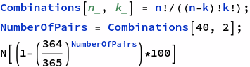

```wl
Out[]= 88.2336
```

```wl
In[]:= BirthdayChance[n_] = 100* (1 - ((364/365)^Combinations[n, 2]));
 DiscretePlot[BirthdayChance[n], {n, 2, 100}]
```

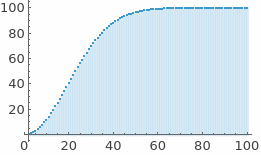

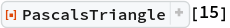

|  |  |  |  |  |  |  |  |  |  |  |  |  |  |  |  |  |  |  |  |  |  |  |  |  |  |  |  |  |
| - | - | - | - | - | - | - | - | - | - | - | - | - | - | - | - | - | - | - | - | - | - | - | - | - | - | - | - | - |
|  |  |  |  |  |  |  |  |  |  |  |  |  |  | 1 |  |  |  |  |  |  |  |  |  |  |  |  |  |  |
|  |  |  |  |  |  |  |  |  |  |  |  |  | 1 |  | 1 |  |  |  |  |  |  |  |  |  |  |  |  |  |
|  |  |  |  |  |  |  |  |  |  |  |  | 1 |  | 2 |  | 1 |  |  |  |  |  |  |  |  |  |  |  |  |
|  |  |  |  |  |  |  |  |  |  |  | 1 |  | 3 |  | 3 |  | 1 |  |  |  |  |  |  |  |  |  |  |  |
|  |  |  |  |  |  |  |  |  |  | 1 |  | 4 |  | 6 |  | 4 |  | 1 |  |  |  |  |  |  |  |  |  |  |
|  |  |  |  |  |  |  |  |  | 1 |  | 5 |  | 10 |  | 10 |  | 5 |  | 1 |  |  |  |  |  |  |  |  |  |
|  |  |  |  |  |  |  |  | 1 |  | 6 |  | 15 |  | 20 |  | 15 |  | 6 |  | 1 |  |  |  |  |  |  |  |  |
|  |  |  |  |  |  |  | 1 |  | 7 |  | 21 |  | 35 |  | 35 |  | 21 |  | 7 |  | 1 |  |  |  |  |  |  |  |
|  |  |  |  |  |  | 1 |  | 8 |  | 28 |  | 56 |  | 70 |  | 56 |  | 28 |  | 8 |  | 1 |  |  |  |  |  |  |
|  |  |  |  |  | 1 |  | 9 |  | 36 |  | 84 |  | 126 |  | 126 |  | 84 |  | 36 |  | 9 |  | 1 |  |  |  |  |  |
|  |  |  |  | 1 |  | 10 |  | 45 |  | 120 |  | 210 |  | 252 |  | 210 |  | 120 |  | 45 |  | 10 |  | 1 |  |  |  |  |
|  |  |  | 1 |  | 11 |  | 55 |  | 165 |  | 330 |  | 462 |  | 462 |  | 330 |  | 165 |  | 55 |  | 11 |  | 1 |  |  |  |
|  |  | 1 |  | 12 |  | 66 |  | 220 |  | 495 |  | 792 |  | 924 |  | 792 |  | 495 |  | 220 |  | 66 |  | 12 |  | 1 |  |  |
|  | 1 |  | 13 |  | 78 |  | 286 |  | 715 |  | 1287 |  | 1716 |  | 1716 |  | 1287 |  | 715 |  | 286 |  | 78 |  | 13 |  | 1 |  |
| 1 |  | 14 |  | 91 |  | 364 |  | 1001 |  | 2002 |  | 3003 |  | 3432 |  | 3003 |  | 2002 |  | 1001 |  | 364 |  | 91 |  | 14 |  | 1 |

100 Prisoners problem
100 prisoners go into a room one by one and choose 50 cabinets numbered cabinets from 1-100 out of 100 to open. They try to find the one that matches their prisoner number(1-100) inside the 50 cabinets.

Random picking strategy

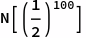

```wl
Out[]= 7.88861*10^-31
```

Another strategy is to start with the cabinet that matches their number. Then, if they don't find their number inside, they go to the cabinet with the number inside the previous one. This way, the prisoner will end up in a permutation cycle. The prisoners win if no cycle is longer than 50. But if they lose, then at least 51 of them lose.

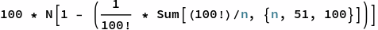

```wl
Out[]= 31.1828
```

## 6. Harmonic Numbers

```wl
In[]:= Table[N[HarmonicNumber[i]], {i, 100}]
```

```wl
Out[]= {1., 1.5, 1.83333, 2.08333, 2.28333, 2.45, 2.59286, 2.71786, 2.82897, 2.92897, 3.01988, 3.10321, 3.18013, 3.25156, 3.31823, 3.38073, 3.43955, 3.49511, 3.54774, 3.59774, 3.64536, 3.69081, 3.73429, 3.77596, 3.81596, 3.85442, 3.89146, 3.92717, 3.96165, 3.99499, 4.02725, 4.0585, 4.0888, 4.11821, 4.14678, 4.17456, 4.20159, 4.2279, 4.25354, 4.27854, 4.30293, 4.32674, 4.35, 4.37273, 4.39495, 4.41669, 4.43796, 4.4588, 4.47921, 4.49921, 4.51881, 4.53804, 4.55691, 4.57543, 4.59361, 4.61147, 4.62901, 4.64625, 4.6632, 4.67987, 4.69626, 4.71239, 4.72827, 4.74389, 4.75928, 4.77443, 4.78935, 4.80406, 4.81855, 4.83284, 4.84692, 4.86081, 4.87451, 4.88802, 4.90136, 4.91451, 4.9275, 4.94032, 4.95298, 4.96548, 4.97782, 4.99002, 5.00207, 5.01397, 5.02574, 5.03737, 5.04886, 5.06022, 5.07146, 5.08257, 5.09356, 5.10443, 5.11518, 5.12582, 5.13635, 5.14676, 5.15707, 5.16728, 5.17738, 5.18738}
```

$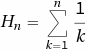$
$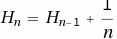$
$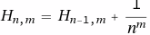$
$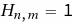$

There are some applications of Harmonic numbers in problems such as card stacking and traffic bunching.

## 7. Partitions

## 8. Bernoulli Numbers

This sequence is somewhat abstract and unintuitive, so we will go over how Bernoulli discovered this.
$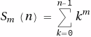$

```wl
In[]:= Grid[Table[{m, Expand[Sum[k^m, {k, 0, n - 1}]]}, {m, 0, 10}]]
```

|  |  |
| - | - |
| 0 | n |
| 1 | -Plus- |
| 2 | -Plus- |
| 3 | -Plus- |
| 4 | -Plus- |
| 5 | -Plus- |
| 6 | -Plus- |
| 7 | -Plus- |
| 8 | -Plus- |
| 9 | -Plus- |
| 10 | -Plus- |

$S_m(n)=\frac{1}{m+1}\left(B_0n^{m+1}+\left(
\begin{array}{c}
 m+1 \\
 1 \\
\end{array}
\right)B_1n^m+\text{...}+\left(
\begin{array}{c}
 m+1 \\
 m \\
\end{array}
\right)B_mn\right)$
$S_m(n)=\frac{1}{m+1}\sum _{k=0}^m \left(\left(
\begin{array}{c}
 m+1 \\
 k \\
\end{array}
\right)B_kn^{(m+1-k)}\right)$

```wl
In[]:= Expand[Sum[k^15, {k, 0, n - 1}]*(16)]
 Table[Coefficient[%, n, i]/Binomial[16, 16 - i], {i, 1, 16}]
 Reverse[%]
 Table[BernoulliB[n], {n, 0, 15}]
```

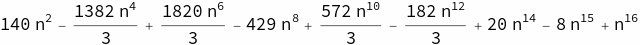

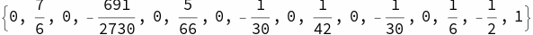

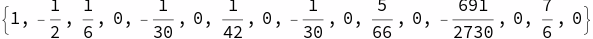


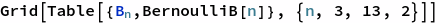

|  |  |
| - | - |
| -Subscript- | 0 |
| -Subscript- | 0 |
| -Subscript- | 0 |
| -Subscript- | 0 |
| -Subscript- | 0 |
| -Subscript- | 0 |

Recursive definition: $B^+{}_n=1-\sum _{k=0}^{n-1} \left(
\begin{array}{c}
 n \\
 k \\
\end{array}
\right)\frac{B_k}{(n-k+1)}$.

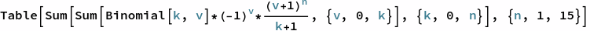

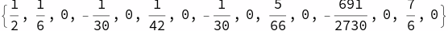

$B_n=\delta _{n,0}-\sum _{k=0}^{n-1} \left(
\begin{array}{c}
 n \\
 k \\
\end{array}
\right)\frac{B_k}{(n-k+1)}$
$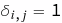$ if i=j and 0 otherwise
$B_{2n}=(-1)^{n+1}2\frac{(2n!)}{(2\pi )^{2n}}\zeta (2n).B^+{}_n=-\text{n$\zeta $}(1-n) \text{for} \text{\textit{$n$}} \geq 1.$

## 9. Stirling Numbers

Map problem
Suppose that there are 6 markers on a map, and they are all connected by exactly one edge. How many ways are there to visit each marker exactly once(starting point doesn't matter)?

Stirling numbers(1st kind)
$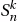$ is the number of ways to separate $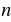$ objects into $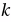$ cycles
If $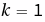$,  $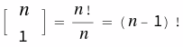$
For each new object, add it to an existing cycle or start a new one.
Recurrence relation: $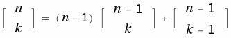$

Stirling numbers(2nd kind)
$$(this is different) is the number of ways to partition a set of $$ objects into $$ subsets
If $$ or $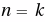$, $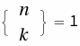$
For each new element, add it to an existing subset or a new one.
Recurrence relation: $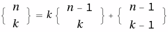$

```wl
In[]:= Abs[StirlingS1[6, 1]] (*to verify our solution to the map problem*)
```

```wl
Out[]= 120
```

```wl
In[]:= Grid[Table[{n, Table[Abs[StirlingS1[n, k]], {k, 0, 10}]}, {n, 0, 10}],Alignment -> Left]
```

|  |  |
| - | - |
| 0 | {1, 0, 0, 0, 0, 0, 0, 0, 0, 0, 0} |
| 1 | {0, 1, 0, 0, 0, 0, 0, 0, 0, 0, 0} |
| 2 | {0, 1, 1, 0, 0, 0, 0, 0, 0, 0, 0} |
| 3 | {0, 2, 3, 1, 0, 0, 0, 0, 0, 0, 0} |
| 4 | {0, 6, 11, 6, 1, 0, 0, 0, 0, 0, 0} |
| 5 | {0, 24, 50, 35, 10, 1, 0, 0, 0, 0, 0} |
| 6 | {0, 120, 274, 225, 85, 15, 1, 0, 0, 0, 0} |
| 7 | {0, 720, 1764, 1624, 735, 175, 21, 1, 0, 0, 0} |
| 8 | {0, 5040, 13068, 13132, 6769, 1960, 322, 28, 1, 0, 0} |
| 9 | {0, 40320, 109584, 118124, 67284, 22449, 4536, 546, 36, 1, 0} |
| 10 | {0, 362880, 1026576, 1172700, 723680, 269325, 63273, 9450, 870, 45, 1} |

```wl
In[]:= Grid[Table[{n, Table[Abs[StirlingS2[n, k]], {k, 0, 10}]}, {n, 0, 10}],Alignment -> Left]
```

|  |  |
| - | - |
| 0 | {1, 0, 0, 0, 0, 0, 0, 0, 0, 0, 0} |
| 1 | {0, 1, 0, 0, 0, 0, 0, 0, 0, 0, 0} |
| 2 | {0, 1, 1, 0, 0, 0, 0, 0, 0, 0, 0} |
| 3 | {0, 1, 3, 1, 0, 0, 0, 0, 0, 0, 0} |
| 4 | {0, 1, 7, 6, 1, 0, 0, 0, 0, 0, 0} |
| 5 | {0, 1, 15, 25, 10, 1, 0, 0, 0, 0, 0} |
| 6 | {0, 1, 31, 90, 65, 15, 1, 0, 0, 0, 0} |
| 7 | {0, 1, 63, 301, 350, 140, 21, 1, 0, 0, 0} |
| 8 | {0, 1, 127, 966, 1701, 1050, 266, 28, 1, 0, 0} |
| 9 | {0, 1, 255, 3025, 7770, 6951, 2646, 462, 36, 1, 0} |
| 10 | {0, 1, 511, 9330, 34105, 42525, 22827, 5880, 750, 45, 1} |

Rising factorial: $x^{\bar{n}}=\sum _{k=0}^n \left[
\begin{array}{c}
 n \\
 k \\
\end{array}
\right]x^k$
Falling factorial: $x^n=\sum _{k=0}^n \left\{
\begin{array}{c}
 n \\
 k \\
\end{array}
\right\}x^{\underline{k}}$

As $$ grows without bounds for a fixed value of $$:  $\left\{
\begin{array}{c}
 n \\
 k \\
\end{array}
\right\}\Longrightarrow \frac{k^n}{k!}$	
As $$ grows without bounds for a fixed value of $$: $\left[
\begin{array}{c}
 n+k \\
 k \\
\end{array}
\right]\Longrightarrow \frac{k^{2n}}{2^nn!}$

Lah numbers: $L(n,k)=\left(
\begin{array}{c}
 n-1 \\
 k-1 \\
\end{array}
\right)\frac{n!}{k!}$
They represent the number of ways to partition a set with $$ elements into $$ linearly ordered subsets(every element of the subset is comparable).
$L(n,k)=\sum _{j=0}^n \left[
\begin{array}{c}
 n \\
 j \\
\end{array}
\right]\left\{
\begin{array}{c}
 j \\
 k \\
\end{array}
\right\}$
Bell Numbers: $B_n=\sum _{k=0}^n \left\{
\begin{array}{c}
 n \\
 k \\
\end{array}
\right\}$

Formulae
$\left\{
\begin{array}{c}
 n \\
 k \\
\end{array}
\right\}=\sum _{j=1}^k (-1)^{k-j}\frac{j^{n-1}}{(j-1)!(k-j)!}$
$B_m=\sum _{k=0}^m \frac{(-1)^kk!}{k+1}\left\{
\begin{array}{c}
 m \\
 k \\
\end{array}
\right\}$

## 10. Sequence Recognition

This section is all about how to recognize a sequence based on its elements.

```wl
In[]:= {49, 89, 141, 205, 281, 369, 469, 581};
```

```wl
In[]:= Differences[%]
```

```wl
Out[]= {12, 12, 12, 12, 12, 12}
```

```wl
In[]:= Table[6 x^2 - 2 x + 1, {x, 3, 10}]
```

```wl
Out[]= {49, 89, 141, 205, 281, 369, 469, 581}
```

```wl
In[]:= {150.489, 394.42, 1053.04, 2831.3, 7632.6, 20596.1, 55597.6, 150102}
 N[Ratios[%]]
 Table[2.7 - %[[x]], {x, 1, 7}]
 150.489 - 2.7^5  (*close enough to 7*)
 Table[2.7^n + 7, {n, 5, 12}]
```

```wl
Out[]= {150.489, 394.42, 1053.04, 2831.3, 7632.6, 20596.1, 55597.6, 150102}
```

```wl
Out[]= {2.62092, 2.66984, 2.68869, 2.69579, 2.69844, 2.69942, 2.69979}
```

```wl
Out[]= {0.0790775, 0.0301557, 0.0113082, 0.00420655, 0.00156172, 0.000576323, 0.000207203}
```

```wl
Out[]= 6.99993
```

```wl
Out[]= {150.489, 394.42, 1053.04, 2831.3, 7632.6, 20596.1, 55597.6, 150102.}
```

```wl
In[]:= FindSequenceFunction[{2, 2, 3, 4, 6, 9, 14}, n]
 FindSequenceFunction[{{0, 1}, {1, 2}, {2, 4}, {3, 8}, {4, 16}, {5, 32}},n]
```

```wl
Out[]= 1 + Fibonacci[n]
```

```wl
Out[]= 2^n
```

```wl
In[]:= FindGeneratingFunction[{-1, -1, -2, -3, -5, -8}, x]
 FindLinearRecurrence[{5, 11, 17, 23, 29, 35}]
 Clear[f]
 RSolve[{f[n] == 2 f[n - 1] - f[n - 2], f[1] == 5, f[2] == 11}, f[n], n]
 Clear[f]
 RSolve[f[n] == f[n - 1] + f[n - 2], f[n], n]
 RSolve[{f[n] == f[n - 1] + f[n - 2], f[1] == 1, f[2] == 2}, f[n], n]
 RSolveValue[{f[n] == f[n - 1] + f[n - 2], f[1] == 1, f[2] == 2}, f[n],n]
```

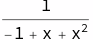

```wl
Out[]= {2, -1}
```

```wl
Out[]= {{f[n] -> -1 + 6 n}}
```

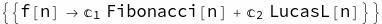

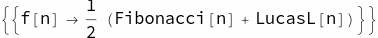

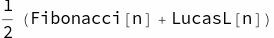

```wl
In[]:= Table[{x, 11.76 x + RandomInteger[{-5, 5}]}, {x, 0, 10}];
 LinearModelFit[%, x, x]
```

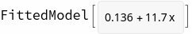

## 11. Generating Functions

Generating function of $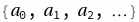$ is $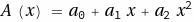$.

Let $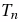$ be the number of ways to tile a $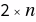$ grid with $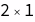$ dominoes.
We find that $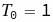$, $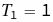$, $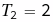$, $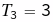$, $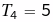$.
Each time we add new blocks, we can add 2 horizontal blocks or 1 vertical block.
We find the recurrence relation $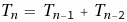$.
This has the same initial values and recurrence relation as the Fibonacci sequence, so we can say that this is the Fibonacci sequence.

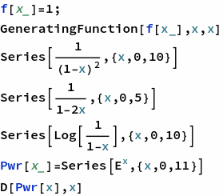

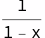

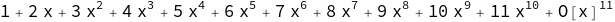

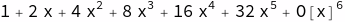

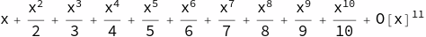

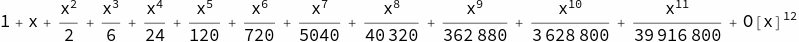

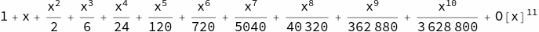

##### Properties of generating functions

- $\text{$\alpha $F}(x)+\text{$\beta $G}(x)=\alpha \sum _{n=0}^{\infty } f_nx^n+\beta \sum _{n=0}^{\infty } g_nx^n$$=\sum _{n=0}^{\infty } f\left(\alpha  f_n+\beta  g_n\right) x^n$

- $F(c x)=\sum _{n=0}^{\infty } f_n (c x)^n=\sum _{n=0}^{\infty } f_nc^nx^n$

- $F'(x)=\sum _{n=0}^{\infty } (n+1)f_{n+1}x^n$

    - $x F'(x)=\sum _{n=0}^{\infty } n f_n x^n$

    - $\int_0^x f(t) \, dt=\sum _{n=0}^{\infty } \frac{1}{n}g_{n-1}x^n$

- $x^mF(x)=\sum _{n=0}^{\infty } f_nx^{n+m}=\sum _{n=0}^{\infty } f_{n-m}x^n$

Convolutions are like multiplication for generating functions.

- $F(x)G(x)=\sum _{n=0}^{\infty } \left(\sum _{k=0}^{\infty } f_kg_{n-k}\right)x^n$

    - $F(x)G(x)=\left(f_0+f_1x+f_2x^2\text{...}\right)\left(g_0+g_1x+g_2x^2\text{...}\right)$

    - This is sometimes also called the Cauchy product.

    - $\left[x^n\right](F(x)G(x))=\sum _{k=0}^n f_kg_{n-k}$

## 12&13. Summing Finite & Infinite Series

Summation of finite series:  $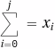$

```wl
In[]:= Sum[i, {i, 5}]
```

```wl
Out[]= 15
```

$\sum _{i=0}^n c a_i=c\sum _{i=0}^n a_i$
$\sum _{i=0}^n a_i+\sum _{i=0}^n b_i=\sum _{i=0}^n a_i+b_i$
$\sum _{i=0}^n a_i=\sum _{n-i=0}^n a_i$
$\sum _{i=0}^{n+1} a_i=a_0+\sum _{i=1}^{n+1} a_i=\left(\sum _{i=0}^n a_i\right)+a_{n+1}$

Summation of arithmetic series
$S=\sum _{i=0}^n a+b i$
$S=\frac{ (2a+b n)(n+1)}{2}$
Summation of geometric series
$S_n=\sum _{i=0}^n a b^i$
$S_n= \frac{a\left(b^{n+1}-1\right)}{(b-1)}$

Suppose we wanted to calculate the volume of a gable house with a slanted roof centered at its midpoint.
The slope of the roof is 60 degrees and the house has a $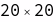$ base with 10m walls.

```wl
In[]:= sumVolume = N[Sum[Sum[((10 - Abs[x])* Tan[60*(\[Pi]/180)] + 10), {y, -10, 10}], {x, -10, 10}]]
 base = 20*20*10;
 roof = 10*Tan[60*\[Pi]/180] * 20*10; 
 volume = N[base + roof]
 error = Abs[sumVolume - volume]/volume * 100
```

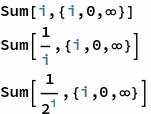


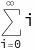


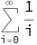

```wl
Out[]= 2
```

But, our definition of divergence says that $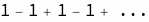$ is convergent, but it oscillates between 0 and 1 periodically. If we manipulate this sum as if it was convergent, we find that it is $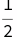$, which can't be, because the value if always either 0 or 1.
Therefore, we must change our definition of convergent to if the series converges to a limit as the length of the series becomes infinite. This means the sum above is divergent, as it does not approach to a limit.
If a series converges absolutely if it converges and if you take the absolute value of each term is also does.

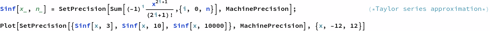


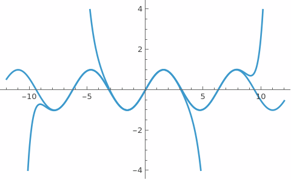

```wl
In[]:= Plot[SetPrecision[Table[20*Sinf[x, 10^n], {n, 0, 3}], MachinePrecision], {x, -30, 30}, PlotRange -> 100]
```


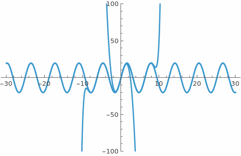

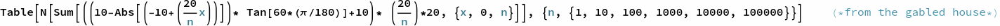

```wl
Out[]= {8000., 7864.1, 7504.1, 7468.1, 7464.5, 7464.14}
```

## 14. Convergence Tests

Based on our earlier definition of convergence, a series is only convergent if the terms approach 0. 
But, if the terms approach 0, this tells us nothing, as the sum $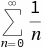$ has terms that approach 0, even though it is divergent. 
This test is only designed for checking some divergent series.


**Integral** test
Integral: $\int_{n_0}^{\infty } a(x) \, dx$

- $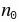$ must be a natural number.

- $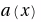$ must decrease as $$ increases.

- $$ must be positive for all $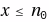$.

- $$ must be continuous for all $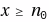$.

**
Limit comparison** test
$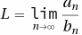$
If $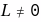$ and $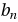$ is divergent, then $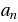$ is also divergent.
Otherwise, $$ is convergent.

**
Alternating Series** Test
Sum: $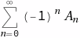$
Conditions: $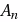$ is non-negative for $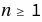$, $$ is monotone decreasing(never increasing), and $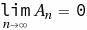$.
If all conditions hold, then $$ converges.

**Ratio** Test
The ratio test states that if the absolute value of the ratio between one term and the next is larger than 1(the series is increasing), then the series will diverge. Similarly, if it is less than 1, then the series will converge.
If the ratio is 1(no change between terms), then no conclusion can be made.

## 15. Volume of N-D sphere

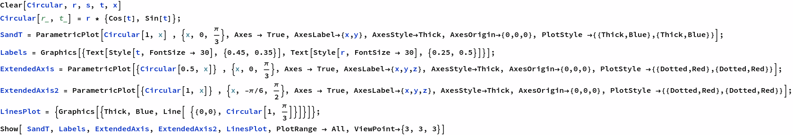

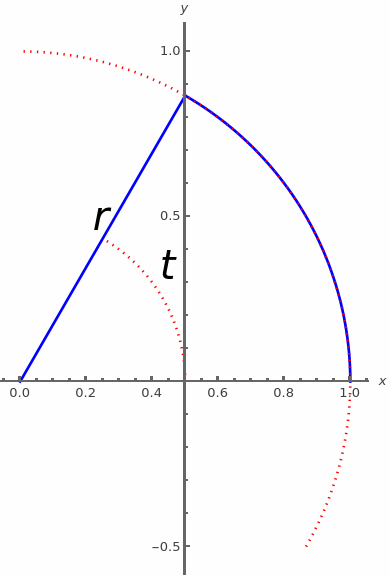

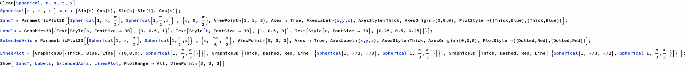

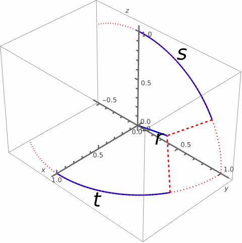

```wl
In[]:= ParametricPlot3D[Spherical[r, s, 0], {r, 2, 3}, {s, 0, 1}, ViewPoint -> Front]
 ParametricPlot3D[{r, s, 0}, {r, 2, 3}, {s, 0, 1}, ViewPoint -> Top]
```

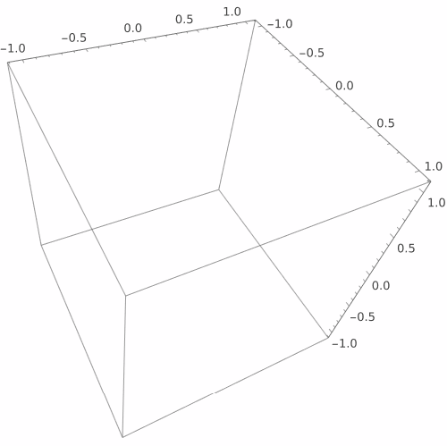

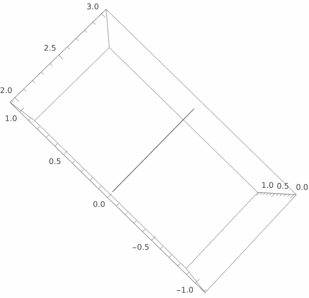

```wl
In[]:= Clear[x, y, z, t, r, s, u, v, r, Second, p, s, q, v, u];
 x[p_, s_, q_, v_, u_] = p Sin[u] Cos[q] Cos[s];
 y[p_, s_, q_, v_, u_] = p Sin[u] Cos[q] Sin[s];
 z[p_, s_, q_, v_, u_] = p Sin[u] Sin[q] Cos[v];
 t[p_, s_, q_, v_, u_] = p Sin[u] Sin[q] Sin[v];
 g[p_, s_, q_, v_, u_] = p Cos[u];
 Clear[gradx, grady, gradz, Vxyz];
 gradx[p_, s_, q_, v_, u_] = {D[x[p, s, q, v, u], p], D[x[p, s, q, v, u], s], D[x[p, s, q, v, u], q], D[x[p, s, q, v, u], v], D[x[p, s, q, v, u], u]};
 grady[p_, s_, q_, v_, u_] = {D[y[p, s, q, v, u], p], D[y[p, s, q, v, u], s], D[y[p, s, q, v, u], q], D[y[p, s, q, v, u], v], D[y[p, s, q, v, u], u]};
 gradz[p_, s_, q_, v_, u_] = {D[z[p, s, q, v, u], p], D[z[p, s, q, v, u], s], D[z[p, s, q, v, u], q], D[z[p, s, q, v, u], v], D[z[p, s, q, v, u], u]};
 gradt[p_, s_, q_, v_, u_] = {D[t[p, s, q, v, u], p], D[t[p, s, q, v, u], s], D[t[p, s, q, v, u], q], D[t[p, s, q, v, u], v], D[t[p, s, q, v, u], u]};
 gradg[p_, s_, q_, v_, u_] = {D[g[p, s, q, v , u], p], D[g[p, s, q, v, u], s], D[g[p, s, q, v, u], q], D[g[p, s, q, v, u], v], D[g[p, s, q, v, u], u]};
 Vxyz[p_, s_, q_, v_, u_] = Abs[Det[{gradx[p, s, q, v, u], grady[p, s, q, v, u], gradz[p, s, q, v, u], gradt[p, s, q, v, u], gradg[p, s, q, v, u]}]];
 Integrate[Vxyz[p, s, q, v, u], {p, 0, r}, {s, 0, 2 Pi}, {q, 0, Pi/2}, {v, 0, Pi}, {u, 0, 2 Pi}]
```

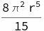


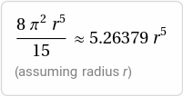

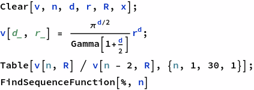

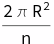

```wl
In[]:= RSolveValue[{v[n] == 2 Pi v[n - 2]/n, v[2] == Pi, v[3] == 4/3 Pi}, v[n], n]
 Table[%, {n, 2, 6}]
```

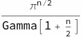

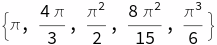

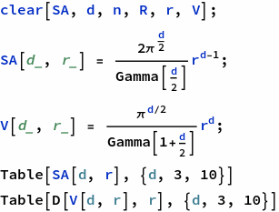

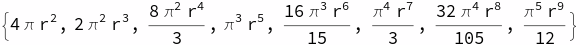


```wl
In[]:= Clear[Spherical, r, s, t, x]
 Spherical[r_, s_, t_] = r * {Sin[s] Cos[t], Sin[s] Sin[t], Cos[s]};
 ParametricPlot3D[Spherical[r, s, 0], {r, 0, 3}, {s, 0, 2 \[Pi]}, ViewPoint -> Front]
 ParametricPlot3D[Spherical[r, s, 0], {r, 2, 3}, {s, 0, 2 \[Pi]}, ViewPoint -> Front]
 ParametricPlot3D[Spherical[r, s, 0], {r, 2.8, 3}, {s, 0, 2 \[Pi]}, ViewPoint -> Front]
```

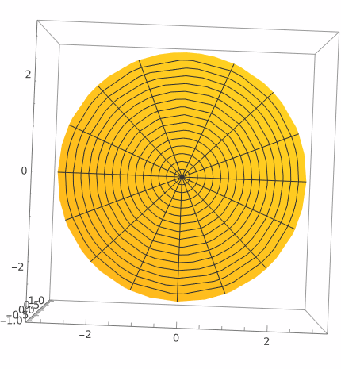

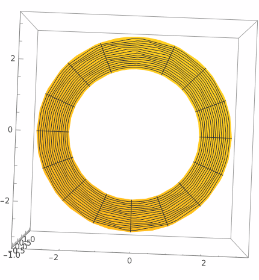

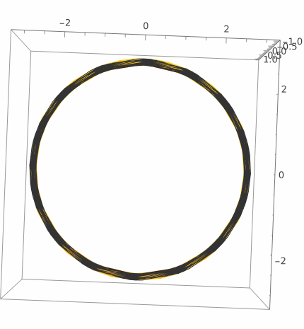

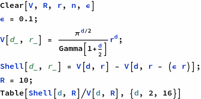

```wl
Out[]= {0.19, 0.271, 0.3439, 0.40951, 0.468559, 0.521703, 0.569533, 0.61258, 0.651322, 0.686189, 0.71757, 0.745813, 0.771232, 0.794109, 0.814698}
```