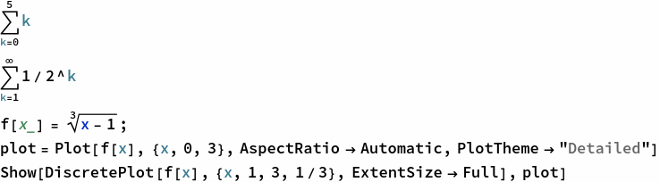
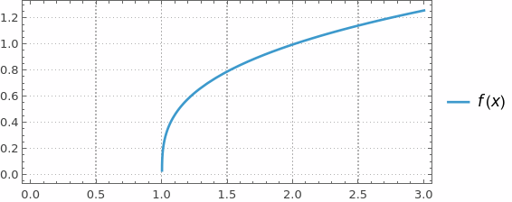
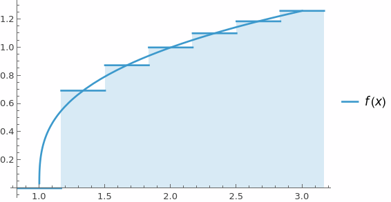
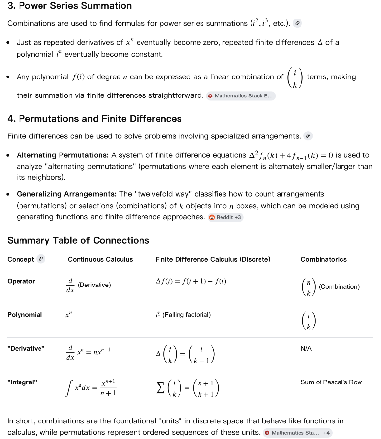

# Discrete Calculus

## 1. Intro

keywords : sequences/series, finite differences, sums/products, gfun
e . g . Finite Sums / Infinite Sums,    Riemann Sums



```wl
Out[]= 15
```

```wl
Out[]= 1
```







```wl
In[]:= 
```